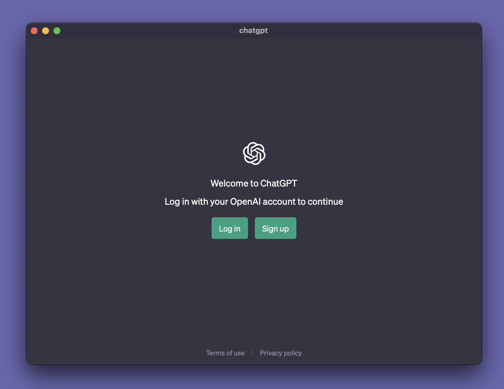

# ChatGPTxTauri

ChatGPTxTauri is a desktop application that allows users to interact with a large language model based on GPT-3.5 architecture. Available on macOS, Linux, and Windows operating systems, the app provides users with a chat interface where they can input text and receive responses generated by the AI model. Users can engage in natural language conversations with ChatGPT on a variety of topics, from general knowledge to more specialized fields. The app is designed to be user-friendly and easy to navigate, making it accessible to users of all technical backgrounds.



## How to run
- Install the .apk file from the release section and run on macOS, Windows or Linux devices.
- Alternatively, you can build your own release by cloning the github repo, and running 
```
pnpm tauri build
```
## Recommended IDE Setup

- [VS Code](https://code.visualstudio.com/) + [Tauri](https://marketplace.visualstudio.com/items?itemName=tauri-apps.tauri-vscode) + [rust-analyzer](https://marketplace.visualstudio.com/items?itemName=rust-lang.rust-analyzer)

## TechStack Used
##### <ul><li>Frontend: TypeScript</li><li>Backend: Rust</li></ul>

## How to Contribute

1. Clone repo and create a new branch: `$ git checkout https://github.com/TESLA2402/ChatGPT-Tauri -b name_for_new_branch`.
2. Make changes and test
3. Submit Pull Request with comprehensive description of changes
